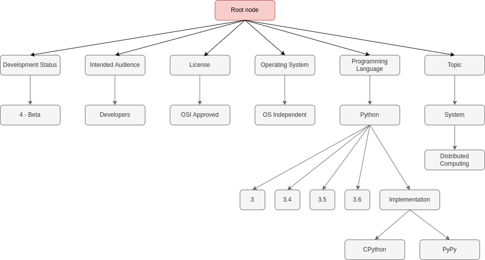

# Learning Models for Hierarchical Multi-label Text Classification

Package data retrieved from PyPI include different kind of information about the project allowing to describe and classify it.
In most cases, a description is provided on the project page on pypi.org, along with [trove classifiers](https://pypi.org/project/trove-classifiers/) to identify in which areas the project is located.
Trove classifiers are labels associated with a project and provided by the package authors to classify it in different categories and sub-categories. 

An example of trove classifiers for the `selinon` package:

```
"Development Status :: 4 - Beta",
"Intended Audience :: Developers",
"License :: OSI Approved :: BSD License",
"Operating System :: OS Independent",
"Programming Language :: Python",
"Programming Language :: Python :: 3",
"Programming Language :: Python :: 3.4",
"Programming Language :: Python :: 3.5",
"Programming Language :: Python :: 3.6",
"Programming Language :: Python :: Implementation :: CPython",
"Programming Language :: Python :: Implementation :: PyPy"
"Topic :: System :: Distributed Computing"
```

The classifiers for a project are organized in **hierarchical** manner and can be represented as Directed Acyclic Graphs (DAG):



## Using trove classifiers in the context of Project2Vec 

In the context of Project2Vec, it would be interesting to be able to predict the trove classifiers of a package to recommend packages with a similar purpose. 
Indeed, trove classifiers differ from simple keywords to describe packages because of two main reasons: 
* their hierarchical organization into topics and sub-topics, which makes them a precious source of organized package metadata,
* there is an official manner to request a new trove classifier, i.e. submitting an issue to the [pypa/trove-classifiers](https://github.com/pypa/trove-classifiers/) (example [here](https://github.com/pypa/trove-classifiers/issues/14)), unlike with keywords which are specified directly by package authors in free-text format.

The classifiers of a package could be predicted using the project description, assuming it is long enough and contains enough relevant information.
As seen in this [experimental notebook](../notebooks/project_classification.ipynb), 
it is possible to deduct keywords corresponding to project based on the pre-processed project description using statistical token ranking methods within a corpus of documents such as [TF-IDF](https://en.wikipedia.org/wiki/Tf%E2%80%93idf). 
If this type of classification does not necessarily require using machine learning algorithms, it is different to predict multiple, hierchically organized labels such as trove classifiers.
If we wished to use a technique such as TF-IDF to predict classifiers, we would have to abandon the notion of hierarchy within the labels and revert to a flat multi-label classification problem, causing a loss of information about more general categories a package could belong to.

To illustrate why this would cause an issue, let's take the following example: 

if the classifiers for the `selinon` package for `Programming Language` were only `"Programming Language :: Python :: Implementation :: CPython"` and
`"Programming Language :: Python :: Implementation :: PyPy"`, then a flat multi-label classification model would not be able to classify the package as using `Python`, but only as having a `CPython` and a `PyPy` implementation.


## Hierchical Multi-Label Text Classification models

Hierarchical Multi-label Text Classification has numerous applications, from patent annotation to classification of businesses given a dataset of reviews.